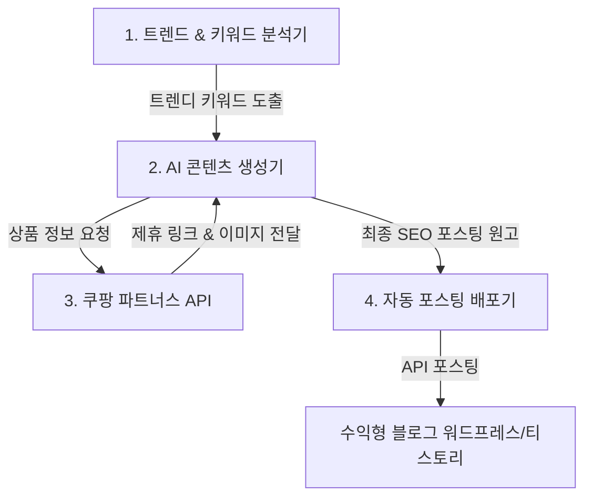

# AutoRevenue-Hub (자동화 수익 시스템) - 기획 및 설계서

본 프로젝트는 **쿠팡 파트너스(Coupang Partners) 제휴 마케팅**과 **구글 애드센스(Google AdSense)** 수익을 극대화하기 위해, 콘텐츠 생산부터 배포까지의 과정을 완전 자동화하는 시스템을 구축하는 프로젝트입니다.

---

## 1. 시스템 개요
본 시스템은 트렌디한 키워드를 분석하여 고품질의 블로그 콘텐츠를 자동으로 생성하고, 본문에 쿠팡 제휴 링크를 삽입한 뒤, 구글 애드센스 광고가 연동된 블로그(워드프레스 또는 티스토리)에 자동으로 포스팅을 수행합니다.

### 💡 핵심 수익 모델
1. **쿠팡 파트너스 수익**: 포스팅 본문의 상품 제휴 링크를 클릭하여 24시간 내 구매 시 구매 금액의 **3% 수수료** 적립
2. **구글 애드센스 수익**: 블로그로 유입된 사용자가 페이지 내 게재된 구글 광고를 클릭하거나 조회할 때 발생하는 **광고 노출/클릭 수익**

---

## 2. 시스템 구성 및 아키텍처

자동화 파이프라인은 다음과 같은 4가지의 모듈로 결합됩니다.

### 🛠 모듈별 핵심 기능
1. **키워드 수집 모듈 (Keyword Collector)**:
   - 구글 트렌드, 네이버 데이터랩, 쇼핑 검색어 순위 등의 소스를 기반으로 최근 급상승하고 있는 상품 관련 키워드를 발굴합니다.
2. **쿠팡 파트너스 연동 모듈 (Coupang Partners Linker)**:
   - 쿠팡 파트너스 API를 이용하여 해당 키워드의 베스트셀러 상품, 할인 정보, 가격 등을 수집합니다.
   - 포스팅에 삽입할 유니크한 개인 파트너스 딥링크(Deep Link)를 생성합니다.
3. **AI 글쓰기 엔진 (AI Content Writer)**:
   - LLM(OpenAI GPT, Claude 등)을 활용해 상품의 장단점, 핵심 스펙, 사용자 후기 등을 가공하여 구글 SEO에 최적화된 고품질 리뷰 문서를 작성합니다.
4. **포스팅 업로더 & 스케줄러 (Publisher & Scheduler)**:
   - 워드프레스(REST API) 혹은 티스토리(API)로 작성된 포스팅을 자동으로 예약 혹은 실시간 발행합니다.
   - 하루에 정해진 주기(예: 매 6시간마다)로 파이프라인이 자동 실행되도록 스케줄러를 운영합니다.

---

## 3. 개발 로드맵 (Roadmap)

* [ ] **1단계: 시스템 설계 및 환경 구축**
  - 개발 환경 세팅 (Python)
  - 필수 라이브러리 설정 및 API Key 연동 환경 구축 (`.env` 설정)
* [ ] **2단계: 쿠팡 파트너스 API 연동 및 상품 정보 수집 개발**
  - 상품 검색 및 딥링크 생성 기능 구현
* [ ] **3단계: AI 글쓰기 템플릿 및 API 연동**
  - LLM API 활용 고품질 본문 생성 자동화
* [ ] **4단계: 블로그 자동 포스팅 기능 개발**
  - 워드프레스 또는 티스토리 API 연동 포스팅 기능 구현
* [ ] **5단계: 스케줄러 등록 및 모니터링 구축**
  - 로컬/클라우드 서버에 자동화 스케줄 등록 및 실행 결과 로깅 기능 구축

---

## 🔑 사전 준비물 (Prerequisites)
시스템 운영을 위해 추후 다음 항목들의 API Key 및 인증 정보가 필요합니다.
1. **쿠팡 파트너스 API Key** (Access Key, Secret Key)
2. **AI API Key** (OpenAI API Key 또는 Anthropic API Key)
3. **블로그 API 정보**
   - 워드프레스 사용 시: 워드프레스 사이트 주소, Application Password
   - 티스토리 사용 시: App ID, Access Token
