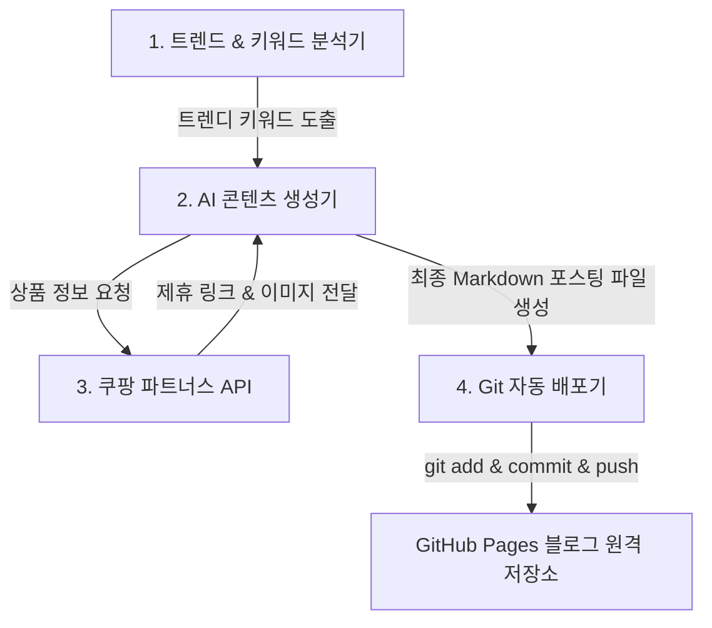

# AutoRevenue-Hub (자동화 수익 시스템) - 기획 및 설계서

본 프로젝트는 **쿠팡 파트너스(Coupang Partners) 제휴 마케팅**과 **구글 애드센스(Google AdSense)** 수익을 극대화하기 위해, 콘텐츠 생산부터 배포까지의 과정을 완전 자동화하는 **Python 기반 자동화 시스템**입니다.

이 프로젝트는 GitHub 사용자 **[koreameme001](https://github.com/koreameme001)**의 **GitHub Pages 정적 블로그** 운영 및 배포 자동화를 기준으로 설계되었습니다.

---

## 1. 시스템 개요
본 시스템은 Python을 활용하여 트렌디한 키워드를 분석하고 고품질의 블로그 콘텐츠를 자동으로 생성한 뒤, 본문에 쿠팡 제휴 링크를 삽입하여 구글 애드센스 광고가 연동된 **GitHub Pages 블로그**에 자동으로 포스팅(Markdown 작성 및 자동 Git Push)을 수행합니다.

### 💡 핵심 수익 모델
1. **쿠팡 파트너스 수익**: 포스팅 본문의 상품 제휴 링크를 클릭하여 24시간 내 구매 시 구매 금액의 **3% 수수료** 적립
2. **구글 애드센스 수익**: GitHub Pages 블로그 테마에 구글 애드센스 광고 스크립트를 삽입하여 유입자에게 광고를 노출하여 수익 발생

---

## 2. 시스템 구성 및 아키텍처

자동화 파이프라인은 다음과 같은 4가지의 Python 모듈로 결합됩니다.



### 🛠 모듈별 핵심 기능 (Python 구현)
1. **키워드 수집 모듈 (Keyword Collector)**:
   - 구글 트렌드, 네이버 데이터랩, 쇼핑 검색어 순위 등의 소스를 기반으로 최근 급상승하고 있는 상품 관련 키워드를 발굴합니다.
2. **쿠팡 파트너스 연동 모듈 (Coupang Partners Linker)**:
   - 쿠팡 파트너스 API를 이용하여 해당 키워드의 베스트셀러 상품, 할인 정보, 가격 등을 수집합니다.
   - 포스팅에 삽입할 유니크한 개인 파트너스 딥링크(Deep Link)를 생성합니다.
3. **AI 글쓰기 엔진 (AI Content Writer)**:
   - LLM(OpenAI GPT, Claude 등)을 활용해 상품의 장단점, 핵심 스펙, 사용자 후기 등을 가공하여 구글 SEO 및 GitHub Pages(Jekyll/Hugo 등)가 인식하는 프론트매터(Front Matter) 양식을 가진 마크다운(`.md`) 문서를 작성합니다.
4. **포스팅 업로더 & 스케줄러 (Publisher & Scheduler)**:
   - 작성된 마크다운 파일을 정적 블로그의 포스트 폴더(예: `_posts/`)에 배치합니다.
   - Python 스크립트가 내부적으로 Git 명령을 수행하여 자동으로 `git add .`, `git commit -m "Auto Post: [제목]"`, `git push`를 진행하여 GitHub Pages 블로그에 글을 자동 업로드합니다.

---

## 3. 개발 로드맵 (Roadmap)

* [ ] **1단계: 시스템 설계 및 환경 구축**
  - 개발 환경 세팅 (Python Virtual Environment & `.gitignore` 설정)
  - GitHub 원격 저장소(`koreameme001/auto_pj`) 연동
  - 필수 라이브러리 설정 및 API Key 연동 환경 구축 (`.env` 설정)
* [ ] **2단계: 쿠팡 파트너스 API 연동 및 상품 정보 수집 개발**
  - 상품 검색 및 딥링크 생성 기능 구현
* [ ] **3단계: AI 글쓰기 템플릿 및 API 연동**
  - LLM API 활용 고품질 마크다운(Front Matter 포함) 본문 생성 자동화
* [ ] **4단계: Git 자동 배포 모듈 개발**
  - GitPython 라이브러리 혹은 Subprocess 연동을 통해 원격 저장소 자동 Push 구현
* [ ] **5단계: 스케줄러 등록 및 모니터링 구축**
  - 로컬/클라우드 서버에 자동화 스케줄 등록 및 실행 결과 로깅 기능 구축

---

## 🔑 GitHub 연동 및 사전 준비물

### 🐙 GitHub Repository 연동 가이드
프로젝트 결과물을 깃허브에 올리기 위한 기본 설정 절차입니다. (계정: `koreameme001`)

```bash
# 1. 원격 저장소(GitHub) 등록 (GitHub에서 auto_pj 저장소 생성 필요)
git remote add origin https://github.com/koreameme001/auto_pj.git

# 2. 브랜치 이름을 main으로 설정 (기본값 master인 경우 변경)
git branch -M main

# 3. 변경사항 업로드
git push -u origin main
```

> [!CAUTION]
> API Key나 비밀번호 등의 민감한 정보는 절대로 GitHub에 직접 업로드되지 않도록 `.env` 파일에 기록하고, `.gitignore` 파일에 `.env`를 반드시 추가해야 합니다. (이 저장소가 곧 GitHub Pages 블로그용 공개 저장소가 될 경우 보안 관리에 각별히 유의해야 합니다.)

### 🔑 필수 API Key 및 인증 정보
시스템 운영을 위해 추후 다음 항목들의 API Key 및 인증 정보가 필요합니다.
1. **쿠팡 파트너스 API Key** (Access Key, Secret Key)
2. **AI API Key** (OpenAI API Key 또는 Anthropic API Key)
3. **GitHub Access Token (PAT)** (자동 git push를 위해 Python 스크립트에서 활용될 권한 토큰)


